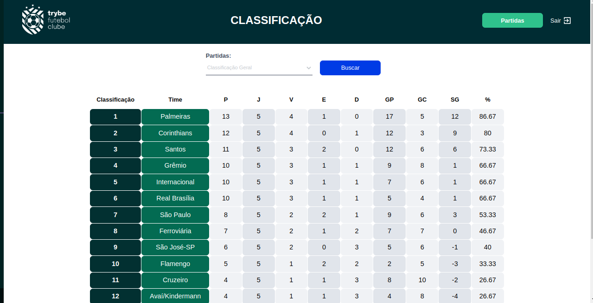

## TFC - Trybe Futebol Clube

Neste projeto foi realizada a construção de uma API rest com typescript, que permiti fazer o CRUD de usuarios, times e partidas. Para fazer o armazenamento das informação foi utilizado o sequelize juntamente com um container docker do mysql. Aqui você poderá acompanhar a classficação dos seus times prediletos , podendo optar por ver seu desempenho fora de casa (visitante), em casa (mandante) e geral (visitante e mandante), pode-se também ver partidas em andamento e finalizadas, podendo filtrar pela qual quiser!

<strong> Rodando com Docker 🐳 </strong>
 

- O arquivo `docker-compose.yml` pode ser utilizado para executar a aplicação na sua máquina local, para isso é necessário executar o comando `npm run compose:up` na raiz do projeto.

  
<strong>Tecnologias Utilizadas e Funcionalidades 💻 </strong>

   
  

  

    Funcionalidades
  

  <ul>
     
   <li> Fazer login com a rota: /login (POST) </li>
   <li> Buscar times com a rota: /teams (GET) </li>
   <li> Buscar time pelo id com a rota: /teams/:id (GET) </li>
   <li> Buscar função com a rota: /login/role (GET) </li>
   <li> Buscar as partidas com a rota: /matches (GET) </li>
   <li> Finalizar uma partida com a rota: /matches/:id/finish (PATCH) </li>
   <li> Atualizar uma partida em andamento com a rota: /matches/:id (PATCH) </li>
   <li> Criar uma partida com a rota: /matches (POST) </li>
   <li> Buscar o ranking dos times de acordo com jogos em casa: /leaderboard/home (GET) </li>
   <li> Buscar o ranking dos times de acordo com jogos fora de casa: /leaderboard/away (GET) </li>
   <li> Buscar o ranking dos times de acordo com jogos em geral: /leaderboard (GET) </li>
  </ul>
 

  

    Tecnologias ultizadas
  

  <ul>
     
    <li> Typescript </li>
    <li> Express </li>
    <li> Sequelize </li>
    <li> Json web token (JWT) </li>
    <li> Docker </li>
    <li> Mocha </li>
    <li> Chai </li>
  </ul>
 

 

